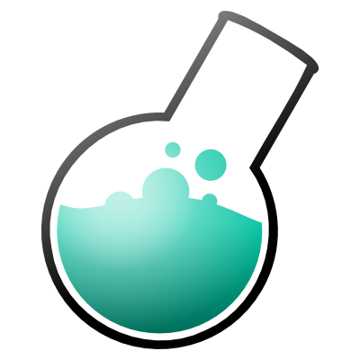
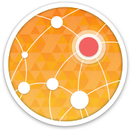
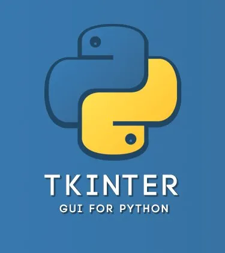
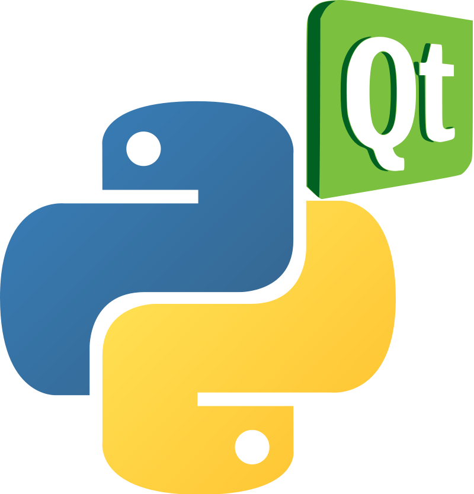
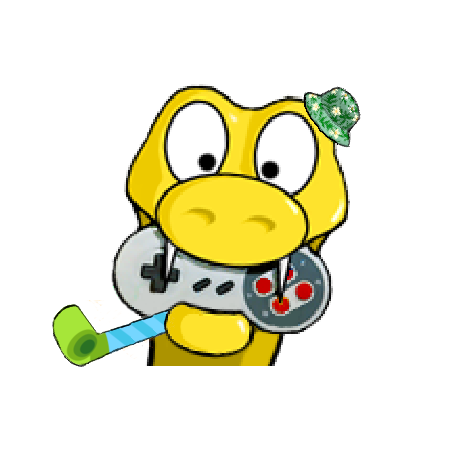
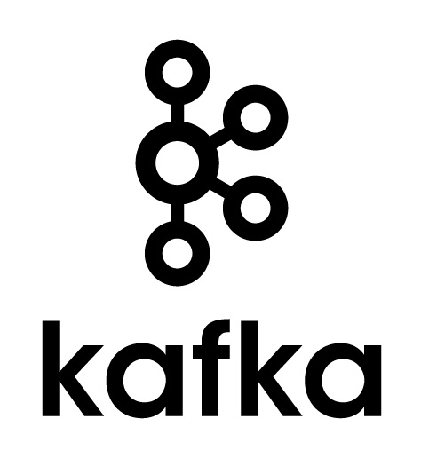
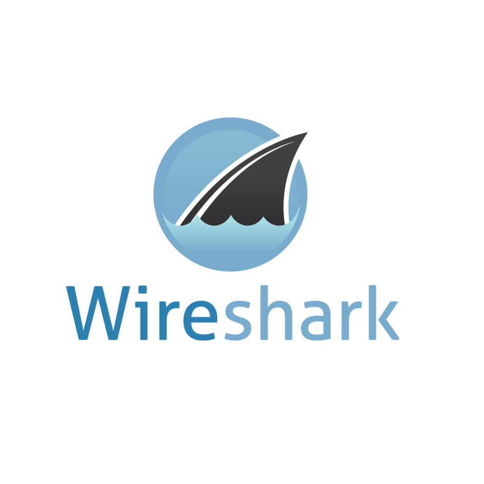

### Salut ! 👋

<picture>
     <source media="(prefers-color-scheme: dark)" srcset="https://raw.githubusercontent.com/Armen-Jean-Andreasian/Armen-Jean-Andreasian/cd66a8efe9be287abedfe43398c1308b2d116e60/pics/github-contribution-grid-snake-dark.svg">
     
</picture>

I'm Armen-Jean Andreasian, a software engineer and a cybersecurity enthusiast. 

---
## Languages:

---
### Web and API:

---
### Web scrapping:

---
### Databases:

---
### Data Science:

---
### GUI:

---
### ML, CV, NLP

---
### Testing:

---
### DevOps, Schedulers, Brokers, etc:

---
### Others:

---
### Other tools:

---
## Social Networks:

---
- 📫 Reach me: [armen_andreasian@proton.me](mailto:armen_andreasian@proton.me)
