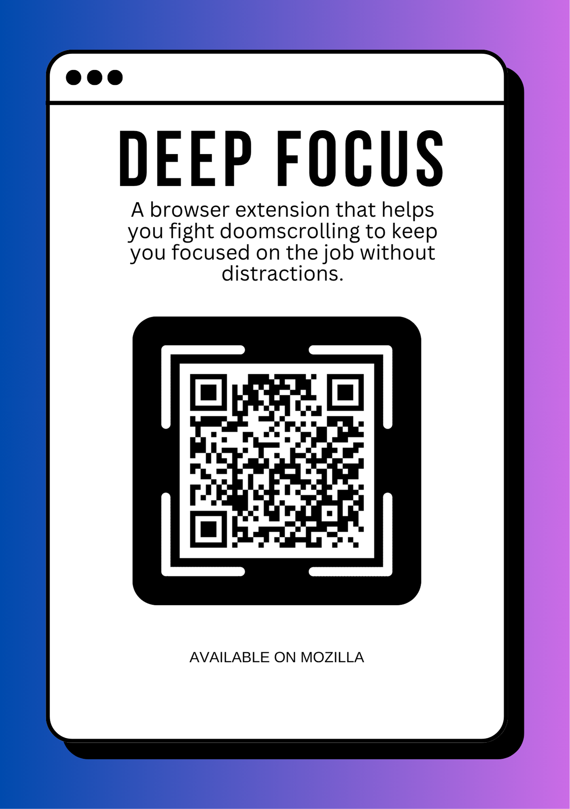
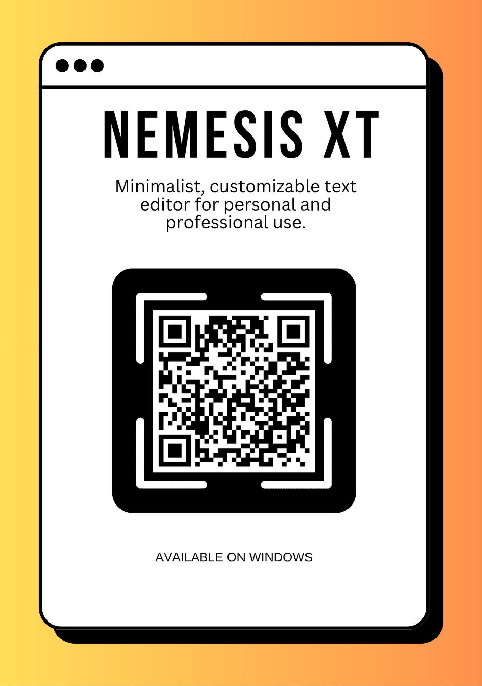
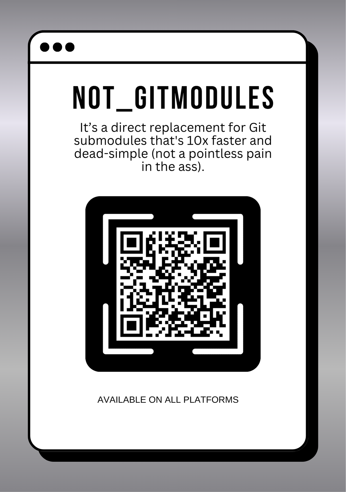

<h1 align="center">Salut 👋, I’m Armen-Jean</h1>
<h3 align="center">Software Engineer and Cybersecurity Enthusiast</h3>

Note: I no longer use GitHub for active development or open-source. This account is kept for reference only.

---
<picture>
     <source media="(prefers-color-scheme: dark)" srcset="https://raw.githubusercontent.com/a-jean-andreasian/a-jean-andreasian/160c48c4ced81d2e2a0e5ee248b7f3a39adb4865/pics/github-contribution-grid-snake-dark.svg">
     
</picture>

---
## 🧪 Open source projects & tools

  
  
  

- **[GGiveaways.de](https://ggiveaways.de/)** *is an independent platform that tracks and lists free game giveaways from official stores like Steam, Epic Games, GOG, Xbox, PlayStation, and more. We're a one-man hobby project created solely to help gamers discover legitimate free game offers.*
- **[DeepFocus](https://addons.mozilla.org/en-US/firefox/addon/deepfocus/)** *is a browser extension that blocks distracting websites and helps you stay focused. A minimalist, but yet the most powerful tool to defeat procrastination. [Source code](https://github.com/Armen-Jean-Andreasian/DeepFocus)*
- **[Nemesis XT](https://github.com/Armen-Jean-Andreasian/NemesisXT-text-editor)** *is a minimalist, customizable, lightweight text editor suitable for both personal and professional use.*
- **[FUT Club Player Values Tracker](https://github.com/a-jean-andreasian/FUT-Club-Player-Values-Tracker)** _A tool to explore and analyze FIFA/FC Ultimate Team (FUT) club player market values._
- **[**Excallibur**](https://github.com/Armen-Jean-Andreasian/Excallibur)** *is an original, statically-typed programming language.*
- **[Not Gitmodules](https://github.com/Armen-Jean-Andreasian/not_gitmodules)** *is a lightweight, open-source utility to simplify the management of external modules in modern dev workflows. Replaces Git Submodules with a tool that's up to 10x faster, cleaner, and drastically improves developer experience.*
- [**Ping Patrol**](https://github.com/a-jean-andreasian/PingPatrol) *- the best tool whether to keep free-tier websites awake, or to ping websites for monitoring their health. Works on all OS, including Windows. Operates natively without any external schedulers.*
- **[Project Master](https://github.com/Armen-Jean-Andreasian/project_master)** *is a lightweight, OS-independent, utility that generates a standardized, customizable project structure to speed up the project setup.*
- **[The Directory Scanner](https://github.com/Armen-Jean-Andreasian/the-directory-scanner)** is a Python lib which scans the directory structures and generates a comprehensive list of files and folders. It provides a convenient way to recursively traverse directories, ignoring specific files and folders specified by the user.
- **[License Header Injector](https://github.com/Armen-Jean-Andreasian/License-header-injector)** *is a Python package designed to automatize insert license headers into your project's source files, instead of infinitely copy-pasting manually. Simply provide the license text, specify the file types, and let the script handle the rest.*
- [**pyddos**](https://github.com/mach1el/pyddos).

---
## 🎓 "From Scratch" Series (for Students)

- [**Web Framework Flash**](https://github.com/Armen-Jean-Andreasian/Flash-Web-Framework):  _An original minimalist Python web framework for educational purposes and lightweight applications. Explains how requests are handled in the RESTful context. Showcases how HTTP and JSON responses are being received, processed and responded. It is also useful for cases if something lightweight is needed._
- [**AI Chatbot from Scratch**](https://github.com/Armen-Jean-Andreasian/ai-chatbot-from-scratch):  _Gather data, classify, create and train a model to have an AI Chatbot_
- [**Requests from Scratch**](https://github.com/Armen-Jean-Andreasian/requests-from-scratch):  _A lightweight Python HTTP client for making requests with built-in support for redirects, JSON handling, and compressed response decoding._
- [**Dotenv from Scratch**](https://github.com/Armen-Jean-Andreasian/dotenv-from-scratch):  _A 14-line substitutor of `python-dotenv`. Is also useful for production no-dependency containerizing._

---
## 📚 "Know How" Series  (for Students)
This is a collection for students as well, however this showcases ready-to-use products. For this I write original code, follow the docs, or implement the ideas of mine or others.

- [**Selfie-AI**](https://github.com/Armen-Jean-Andreasian/Selfie-AI): _An application that allows you to take selfies with real-time face recognition and optional date timestamps. Capture the moment, add intelligence, and snap away!_
- [**Image to Text Converter**](https://github.com/Armen-Jean-Andreasian/Image-to-Text-Converter): _A simple Python project that converts images to text using Optical Character Recognition (OCR) powered by the pytesseract library, with a user-friendly interface built on Streamlit._
- [**Pingo-Pongo**](https://github.com/Armen-Jean-Andreasian/Pingo-Pongo): _Ping-pong game_
- [**ChatGPT-Desktop**](https://github.com/Armen-Jean-Andreasian/ChatGPT-Desktop): _Desktop application to have conversations with ChatGPT in real-time._
- [**Wikipedia-RAG-System**](https://github.com/Armen-Jean-Andreasian/Wikipedia-RAG-System): _A Retrieval-Augmented Generation System with LlamaIndex and GPT-4o for working with Wikipedia articles. Showcases very high-level and production grade AI-integration, without data classification and model training, which the most of the companies do nowadays. Contains guides for seamless installation for Windows and Linux._

---
## Experimental

- [**Betting Odds Calculator**](https://github.com/Armen-Jean-Andreasian/Betting-Odds-Calculator): *Original and mathematical side project aiming to mimic how odds are being calculated. Particularly, it reveals what's the profit of bookmakers, for those who think betting is something serious.*

### Disclaimer: 
> - The projects below are for entertainment and educational purposes only!
> - Also, if you “don’t find them ethical,” spoiler: nah, it's badass, cool, and interesting and genuinely better than mundane ones.

* **[**Banana**](https://github.com/Armen-Jean-Andreasian/Banana)**: _A todo app, which in background DDos attcks Pentagon and hosts a Mexican drug market on Darknet._
* **[Russian-Roulette](https://github.com/Armen-Jean-Andreasian/Russian-Roulette)**: _Windows System32 Random File Deletion Game - The working one + tutorial_
* **[Active Erroring](https://github.com/Armen-Jean-Andreasian/Active-Erroring)**: _A Python package that provides a simple way to raise custom errors with customizable error names, messages with false traces._

  
---
## Game Modding

- [**FIFA 22 Icons Unlocked**](https://github.com/Armen-Jean-Andreasian/Fifa22-Icons-Unlocked) *a custom mod to unlock legendary players across all FIFA 22 modes*
- [**FC 25 Icons Unlocked**](https://github.com/a-jean-andreasian/FC25-ICONS-Unlocked) *a custom mod to unlock legendary players across all FC25 modes. Also it includes 100+ players with their faces of that are not in the game.*

---

