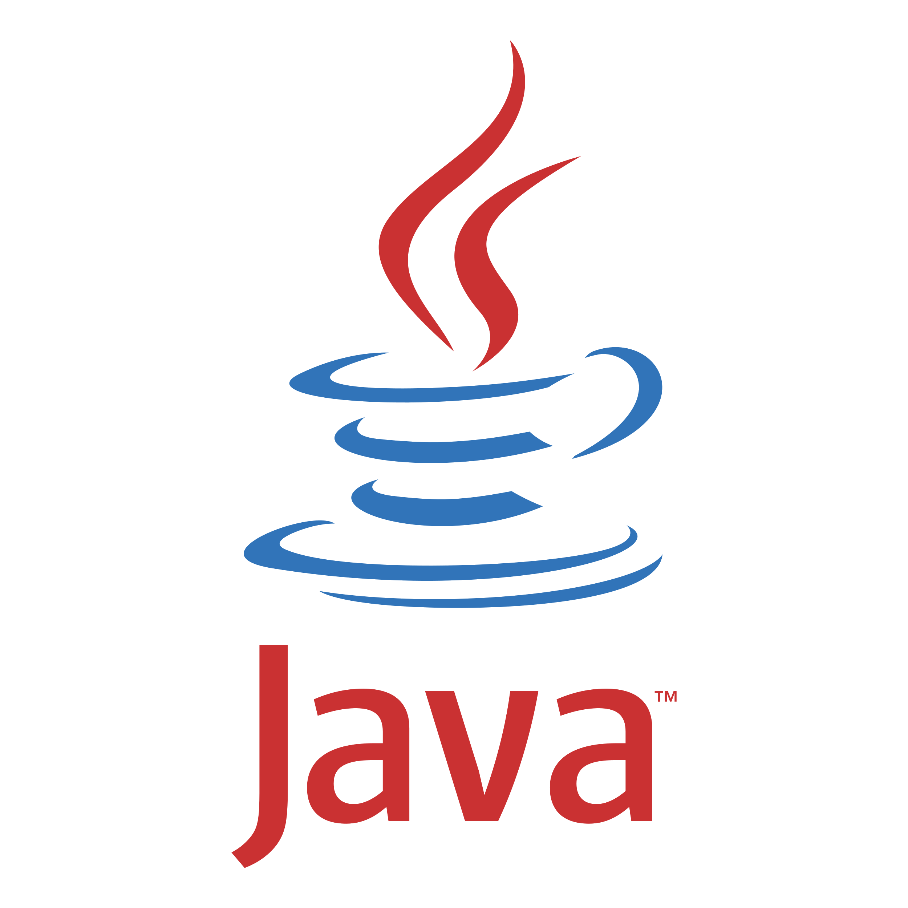
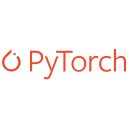
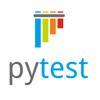
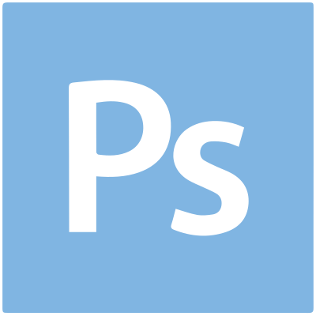
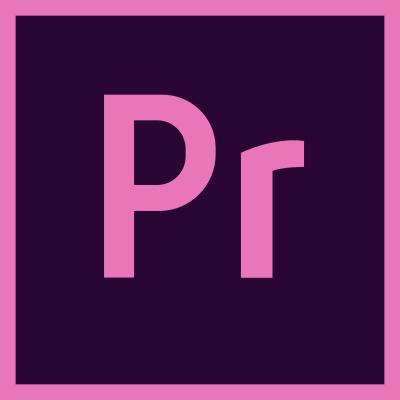

### Salut ! 👋

I'm Armen-Jean Andreasian, a tech enthusiast with a focus on computer science, programming and OSINT.

- 🔭 I’m currently working on various open-source projects and expanding my knowledge.
- 🌱 I’m currently learning quantum computing, neural networks, game development
- ⚡ I’m looking to collaborate on projects related to API-s, neural networks, cybersecurity and open-source contributions.
- 📫 How to reach me: [armen.andreasian77@gmail.com](mailto:armen.andreasian77@gmail.com)

Feel free to reach out, collaborate, or ask any questions related to my areas of interest or my tech stack. Let's connect and learn together!

---
## Tech Stack: 💻

    
---
## Social Networks: 🌐

